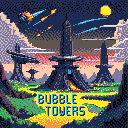

pico-bubble-towers
==================

Tower Defense Game for Pico-8.

Official game thread: TBD

Description
-----------

This is not the usual tower defence game you are used to.
Sure, you have to build towers to defend against enemy waves.
And also earn cash by destroying enemies to update your towers.

What is special here is that we not only can build defence towers to destroy enemies
but also to define the path the enemies can take.
In addition, we have various different maps where some may have blockades,
are limited in space or have already predefined fixed paths.

How to play
-----------

To skip the title image just press `X`
and you can choose your difficulty level you want to play.
Alternatively you can read a small in-game manual that describes most of the core concepts.
After this first selection screen you can choose one of the 16 different maps.
Each step done before starting the game can always be undone by pressing `O`.

After map selection the game is started and allows you to either
place, remove or upgrade towers (all controlled with the cursor).
By pressing `O` you can start the next enemy wave (symbolized at the top center of the screen).

Place towers with `X`.
Hover over it to see its shot or manipulation range.
Selecting it with `X` opens the upgrade menu.
Here too you can always close the menu with `O` if you do not want to do anything with the selected tower.
The upgrade menu gives you many options to progress your towers.
There are attacking towers that can be improved in terms of range, fire rate or damage.
The green towers are specialized for flying enemies.
Special towers can also deal area damage.
This yellow tower then can also be upgraded to enemy modifiers like reducing of movement speed or armor.
Modifier towers are the last category that does not fire at enemies
but improve the properties of all surrounding towers.
Here again we can improve fire rate, range or damage.

Best way to learn all those tower types is to play an easy game and try all possible upgrades.
See how expensive upgrades are and what works best for you or the selected level.
And then try the next harder level or map.
Good luck!

Tower upgrades
--------------

The attached table shows all tower upgrades and their costs and stats.

[tower_upgrades.pdf](assets/tower_upgrades.pdf)

Customization
-------------

If you like this game and want to play more maps you can easily build your own.
Simply open the map editor in pico-8 and change the existing maps to your liking.
No coding is needed.
The only thins you need to ensure is to only use the 3 map sprites and always place exactly 1 start and 1 goal per map.

If you want to tweak the difficulty levels
you can manipulate the corresponding wave definition strings in `CreatePredefinedWaveList`.

Inspiration
-----------

This game is inspired by the old flash games:
[Bubble Tanks Tower Defence](https://herointeractive.fandom.com/wiki/Bubble_Tanks_(Series)#Bubble_Tanks_Tower_Defences).

Some are still playable:

* [armorgames.com](https://armorgames.com/play/4962/bubble-tanks-tower-defense/)
* [games.kidzsearch.com](https://games.kidzsearch.com/computer/title/bubble-tanks-tower-defense-41149)

Used third-party tools and libraries
------------------------------------

* A* algorithm based on: [github.com/wesleywerner/lua-star](https://github.com/wesleywerner/lua-star)
* Background music "Arpument" written by Robby Duguay: [https://www.lexaloffle.com/bbs/?tid=2619](https://www.lexaloffle.com/bbs/?tid=2619)
* `shrinko8` for statistics and better exports: [github.com/thisismypassport/shrinko8](https://github.com/thisismypassport/shrinko8)
* `depict` for demake any image into a pico-8 image: [github.com/bikibird/depict](https://github.com/bikibird/depict)
* `PX9` for compressing title image: [PX9 Data Compression](https://www.lexaloffle.com/bbs/?tid=34058)
* `Luanalysis` for static code analysis in PyCharm: [IntelliJ-Luanalysis](https://github.com/Benjamin-Dobell/IntelliJ-Luanalysis)
* Awesome list for pico-8: [awesome-PICO-8](https://github.com/pico-8/awesome-PICO-8?tab=readme-ov-file#tutorials)

Special thanks to
-----------------

* [martinxyz](https://github.com/martinxyz) for his in-depth play testing and feedback.
* [Krystman](https://github.com/Krystman) for his extensive tutorial [YouTube series](https://www.lexaloffle.com/bbs/?tid=28030) and some inspiration.

License
-------

[![CC BY-NC-SA 4.0][cc-by-nc-sa-shield]][cc-by-nc-sa]

This work is licensed under a
[Creative Commons Attribution-NonCommercial-ShareAlike 4.0 International License][cc-by-nc-sa].

[![CC BY-NC-SA 4.0][cc-by-nc-sa-image]][cc-by-nc-sa]

[cc-by-nc-sa]: http://creativecommons.org/licenses/by-nc-sa/4.0/
[cc-by-nc-sa-image]: https://licensebuttons.net/l/by-nc-sa/4.0/88x31.png
[cc-by-nc-sa-shield]: https://img.shields.io/badge/License-CC%20BY--NC--SA%204.0-lightgrey.svg

Author Information
------------------

Christian Lang

[lang.chr86@gmail.com](mailto:lang.chr86@gmail.com)
