Motivation
----------

\Large
As a gamer, I always wanted to develop a *small game by myself*.

\vspace{1cm}
\normalsize

Prerequisites:

* *Platform* without much overhead.
* *Language* that is easy to use and learn.
* *Inspiration* for a "small" game.

The fantasy game console: PICO-8
--------------------------------

\colBegin{0.6}

* Video game console, but *without real hardware*.
* Emulates an *8-bit system*.
* *Retro* aesthetics.
* *Very limited* on purpose.
* Encourages *creativity and ingenuity*.

\colNext{0.3}

\colEnd

The PICO-8 ecosystem
--------------------

*Language:*

* Subset of *Lua*.
* Powerful *API*.

*Editors:*

* *Code* Editor with tab support.
* *Sprite* Editor with pixel, shape, stamp, etc. functions.
* *Map* Editor: use sprites to draw maps, images, etc.
* *SFX* Editor with pitch or tracker mode.
* *Music* Editor: combine multiple "instruments" to "music".

Distribution
------------

\colBegin{0.6}

* Save as *`.png`* files and load in PICO-8.
* Or export as *web-player*.
* Publish the "Cartridge" (or "Cart") in *BBS* and explore BBS easily with *`splore`*.

\colNext{0.3}

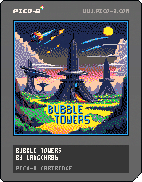

\colEnd

My game: [Bubble Towers](https://www.lexaloffle.com/bbs/?pid=151651)
------------------------

\colBegin{0.7}

*My goals*:

* 2D graphics.
* No story, pure mechanics.
* Easy to learn but hard to master.
* Long-term motivation.

\vspace{0.2cm}
*Result*: Inspired by *[Bubble Tanks Tower Defence](https://herointeractive.fandom.com/wiki/Bubble_Tanks_(Series)#Bubble_Tanks_Tower_Defences)*

\colNext{0.3}

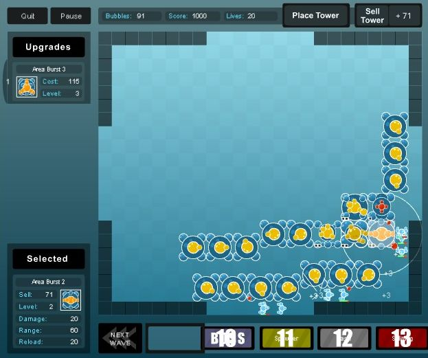{width=90%}

\colEnd

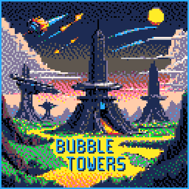{width=30%}
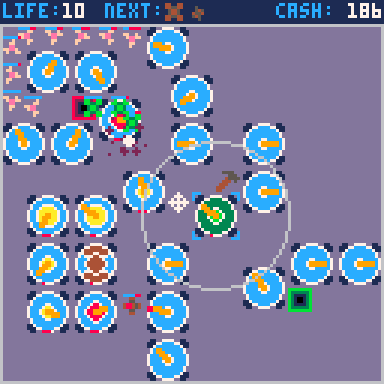{width=30%}
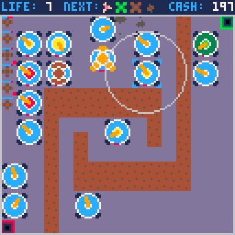{width=30%}

Development with Lua
====================

What is Lua?
------------

\colBegin{0.65}

*Lightweight scripting language*

* Dynamic typed.
* Bytecode that runs on a virtual machine.
* Automatic memory management with incremental garbage collection.

\vspace{0.25cm}
*Fast and portable*

* Similar speed to native C programs.
* Easy integration
  $\break\rightarrow$ useful for plugins and scripting.

\vspace{0.25cm}
*Programming styles*

* procedural
* object-oriented
* functional

\colNext{0.08}

\colNext{0.25}

\vspace{01cm}
{widht=20%}

\colEnd

Core concepts of Lua
--------------------

*Primitives:*

* `nil`
* `boolean`
* `number` (always a double floating point)
* `string`
* `table`
* `function` (this is a first-class citizen)

*Table* can be used as:

* *Array/List* accessed by integer index (usually 1-based).
* *Map* accessed by `string` key.
* *Struct* collecting data.
* *Class* not only containing data but also functions.

Basics
------

Creation of number variable:

~~~{.lua}
a = 1
b = a
b = 2
-- current state: a=1 ; b=2
~~~

This is a primitive type and therefore has *value semantics* (like in C/C++).

\vspace{0.75cm}
Creation of anonymous table referenced by `t` and `u`:

~~~{.lua}
t = {}
u = t
u['x'] = 42    -- create and assign the field 'x' in t/u
print(u['x'])  -- print "42"
~~~

This is an object and therefore has *reference semantics* (like in Java/Python).

Arrays and loops
----------------

~~~{.lua}
list = { 1, 2, 3 }

for i=1, #list do
  v = list[i]
end
~~~

* `#list` returns the size of the list.
* Lists use 1-based indices (by default).

Maps and structs
----------------

~~~{.lua}
map = { x=2, y=4 }

print(map['x'])
print(map.x)      -- syntactic sugar for the above

assert(map.z == nil)
~~~

Inexistent or unset variables return *`nil`* (including non-existing table fields).

Enhanced iteration
------------------

~~~{.lua}
for value in all(list) do
  print(value)
end

for index,value in ipairs(list) do
  print(index)
  print(value)
end

for key,value in pairs(map) do
  print(key)
  print(value)
end
~~~

Conditionals
------------

~~~{.lua}
if <condition> then
  <body>
elseif <condition> then
  <body>
else
  <body>
end
~~~

* Conditionals evaluate `false` and `nil` to *`false`*
* Everything else (including `0` and `""`) to *`true`*

Scope
-----

* Everything is *global* by default.

* Limit scope with *`local`* keyword:
  * in functions
  * in loops

* *Table/Package* scope:
  * access data members with `.`
  * access functions with `.`
  * access methods with `:`

Object-oriented programming
===========================

Member functions
----------------

\colBegin{0.55}

Functions are "normal" *values*.  
We can access members  
with the *`.` operator*.

\colNext{0.5}

We can improve this  
with the *`:` operator*.

\colEnd

\vspace{0.5cm}

\colBegin{0.55}

~~~{.lua}
obj = { x = 42 }

-- "nested" function
function obj.Print(self)
  print(self.x)
end

obj.Print(obj)
~~~

\colNext{0.5}

~~~{.lua}
obj = { x = 42 }

-- member function
function obj:Print()
  print(self.x)
end

obj:Print()
~~~

\colEnd

Metatables & metamethods
------------------------

*Metatables* can define special behavior of a table:

* comparison of tables (e.g. `__eq` for *`==`* operator)
* arithmetic (e.g. `__add` for *`+`* operator)
* etc.

The `__index` *metamethod* defines how to handle "unknown" access:

~~~{.lua}
metatable = { x = 42 }
metatable.__index = metatable

table = {}      -- no 'x'
setmetatable(table, metatable)

print(table.x)  -- access 'x' in metatable
~~~

How the interpreter works
-------------------------

~~~{.lua}
metatable = { x = 42 }
metatable.__index = metatable

table = {}      -- no 'x'
setmetatable(table, metatable)

print(table.x)  -- access 'x' in metatable
~~~

\vspace{0.5cm}
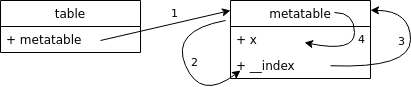

Class and instantiation
-----------------------

* We do not want to define functions per instance.
* Define a *metatable* with *`__index`* metamethod as "Class".
* Define *member functions* in "Class" table.

~~~{.lua}
MyClass = {}
MyClass.__index = MyClass

function MyClass.New()
  obj = { x = 42 }
  return setmetatable(obj, MyClass)
end

function MyClass:Print()
  print(self.x)
end
~~~

How the interpreter works
-------------------------

\colBegin{0.7}

~~~{.lua}
MyClass = {}
MyClass.__index = MyClass             -- 2 + 3

function MyClass.New()
  obj = { x = 42 }
  return setmetatable(obj, MyClass)   -- 1
end

function MyClass:Print()              -- 4
  print(self.x)                       -- 5
end
~~~

\colNext{0.3}

~~~{.lua}
obj = MyClass.New()
obj:Print()
~~~

\colEnd

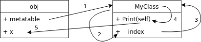

Example class: `Point`
----------------------

\colBegin{0.7}

~~~{.lua}
Point = {}
Point.__index = Point

function Point.New(x, y)
  local o = {
    x = x;
    y = y;
  }
  return setmetatable(o, Point)
end

function Point.__sub(lhs, rhs)
  return Point.New(lhs.x - rhs.x, lhs.y - rhs.y)
end

function Point:Distance(other)
  local diff = other - self
  return math.sqrt(diff.x * diff.x + diff.y * diff.y)
end
~~~

\colNext{0.3}

~~~{.lua}
-- usage
p1 = Point.New(1, 1)
p2 = Point.New(2, 2)

dist = p1:Distance(p2)
print("dist=", dist)

p3 = p1 - p2
print("x=", p3.x)
print("y=", p3.y)
~~~

\colEnd

Additional
----------

* *The caller* needs to use the matching `.` or `:` operator!
* This concept can be extended to implement *inheritance*.
* Lua can also be used as *imperative* or *functional* language.
* It also supports *Coroutines*.

Development tools for Lua
=========================

Common problems in dynamic languages
------------------------------------

\colBegin{0.3}

Access variables with:

* *wrong names*
* *wrong hierarchy*

~~~{.lua}
table = {
  inner = {
    x = 1
  },
  y = 2
}

print (table.x)
-- shoud use "table.inner.x"
~~~

\colNext{0.2}
\colNext{0.5}

Use classes with:

* *wrong operator*
* *missing `self`*

~~~{.lua}
table = { x = 42}

function table:Get()
  return x
  -- should use "self.x"
end

print (table.Get())
-- should use "table:Get()"
~~~

\colEnd

Those problems would be *detected during compile time* in a static typed language.

Static code analysis
---------------

*Static code analysis* can help for such common problems:

* wrong names
* wrong hierarchy
* wrong operators
* missing `self`
* support for refactoring tools

Tools like:

* [Luanalysis](https://github.com/Benjamin-Dobell/IntelliJ-Luanalysis)
* [EmmyLua](https://github.com/EmmyLua)

Type annotations
----------------

~~~{.lua}
---@class Point
---@field x number
---@field y number
Point = {}
Point.__index = Point

---@param x number
---@param y number
---@return Point
function Point.New(x, y)
  local o = {
    x = x;
    y = y;
  }
  return setmetatable(o, Point)
end
~~~

Creativity because of limitations
=================================

PICO-8 Limitations
------------------

\centering
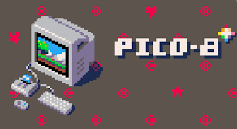{width=40%}

--------  ---------------------------------------------
Display:  128x128, fixed 16 colour palette
Input:    6-button controllers
Carts:    32k data encoded as `.png` files
Sound:    4 channel, 64 definable chip blerps
Code:     P8 Lua (max 8192 tokens of code)
CPU:      4M VM instructions/sec
Sprites:  Single bank of 128 8x8 sprites (+128 shared)
Map:      128 x 32 Tilemap (+ 128 x 32 shared)
--------  ---------------------------------------------

Wave Definition
---------------

* Code size is limited to *8192 tokens*.
* Each enemy wave definition takes *6 tokens*.
* E.g. the "insane" difficulty level has *42 waves* defined like this
  $\break\rightarrow$ 252 tokens.

~~~{.lua}
AddEnemyToList(list, 2, EnemyType.NORMAL)
AddEnemyToList(list, 4, EnemyType.HEAVY)
AddEnemyToList(list, 5, EnemyType.FAST)
AddEnemyToList(list, 3, EnemyType.GHOST)
AddEnemyToList(list, 3, EnemyType.REGENERATE)
...
~~~

Wave Parser
-----------

*Solution:*

* Replace "Add" calls by a string that is *parsed* into the wave list.
* `ParseWaveString` takes *~100 tokens*.
* Each difficulty level is *1 string = 1 token*.

~~~{.lua}
ParseWaveString(list, "0204,0414,0524,0334,0344,...")
~~~

*Trade-off:*

* Bad readability/maintainability
  $\break\rightarrow$ String could be generated with an external script.

Wave Parser
-----------

\colBegin{0.55}

~~~{.lua}
function ParseWaveString(list, data)
  local cnt = 0
  local type = 0

  for i = 1, #data do
    local num = char2num(sub(data, i, i))
    local mode = (i - 1) % 5

    if mode == 0 then
      cnt = 10 * num            --- c
    elseif mode == 1 then
      cnt = cnt + num           --- c
    elseif mode == 2 then
      type = num                --- t
    elseif mode == 3 then
      local value_mul = num / 4 --- v
      add(list, WaveNew(cnt, EnemyNew(type, value_mul)))
    end
  end
end
~~~

\colNext{0.5}

~~~{.lua}
function char2num(char)
  for num = 1, 10 do
    if char ==
        sub("0123456789", num, num) then
      return num - 1
    end
  end
end
~~~

\colEnd

Title image compression
-----------------------

* Title screen fills the whole *128x128 pixels*.
* This is equals to *256 sprites*.
* But we only can define 256 sprites *at maximum*.

\centering
{width=30%}
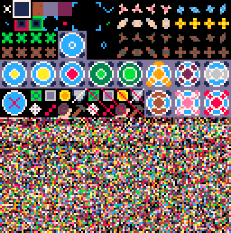{width=30%}

\raggedright
Use *compression algorithms* like [PX9](https://www.lexaloffle.com/bbs/?tid=34058)
with trade-off:

* Save *half of the data* (pixels)
* but introduce *~240 tokens* in code.

Game development basics
=======================

Program flow
------------

Each PICO-8 program *must define* the following functions:

~~~{.lua}
function _init()
  -- startup handling
end

function _update()
  -- logic calculations
end

function _draw()
  -- image rendering
end
~~~

Basic engine execution
----------------------

The engine internally will call them similarly like:

~~~{.lua}
_init()
while true do
  _update()
  if enough_time() then
    _draw()
  end
  sleep_until_next_frame()
end
~~~

* The engine runs by default with *30 FPS*.
* If execution of one loop *takes too long* the next iteration will *only call `_update()`*.
* This *ensures correct behavior* of the game logic (e.g. physics) and only reduce graphical "smoothness".

This is handled similarly in other game engines (e.g. [Android](https://developer.android.com/games/develop/gameloops))

Function delegation
-------------------

* Do not call *all* processing functions directly in `_update()`.
* Introduce a *hierarchy* of objects/agents that have their own `_update()` function.
* Same for `_draw()`

\vspace{0.5cm}
*Main:*

* `StartScreen`
* `DifficultySelection`
* `MapSelection`
* `GameSession`
  * List of `Tower`s
  * List of `Enemy`s
    * List of `Bullet`s
* EndScreen

The `_update()` hierarchy
---------------------

\colBegin{0.55}

~~~{.lua}
function _update()
  active_session:Update()
end

function GameSession:Update()
  -- other logic

  for tower in all(self.tower_list) do
    tower:Update(self.enemy_list)
  end
  
  for enemy in all(self.enemy_list) do
    enemy:Update()
  end
end
~~~

\colNext{0.5}

~~~{.lua}
function Enemy:Update()
  -- other logic
  
  for bullet in all(self.bullet_list) do
    if bullet:InTarget() then
      self:Hit(bullet)
    else
      bullet:Update()
    end
  end
end

function Bullet:Update()
  -- logic
end
~~~

\colEnd

Development history
-------------------

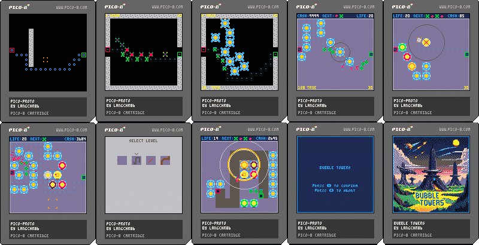

Rapid prototyping
-----------------

* Create *basic variant* of new mechanics and test it.
* Add more mechanics and *fine tune*.
* Or create *separate prototypes* for individual concepts.
* *A/B tests* for groups of mechanics or in test groups.
* Get *feedback* from testers.
* *Iterate*.
* Graphic details, title screen, etc. *come last*.

Game balancing
--------------

\colBegin{0.55}

\vspace{0.3cm}
*Requirements*:

* The game should be challenging but not too hard.
* It should attract beginners and experts.
* All mechanics should be almost equal important and useful.

\colNext{0.05}
\colNext{0.4}

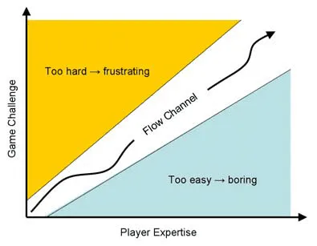

\colEnd

*Approaches*:

* "Buff" and "Nerf" elements to get mechanics into balance.
* Test various strategies to find unbalanced elements.
* Change enemy strengths or rewards.

Other interesting topics
------------------------

* Sprite flags.

* Sound/music design.

* Angle calculations:

* Collision detection.

* Weight algorithms:
  * Target selection.
  * Shoot only on "alive" targets.

* Path finding:
  * A-Star.

* Animations:
  * Particle animations for explosions.
  * Sprite animations.

Addendum
========

Software-Players
----------------

\colBegin{0.5}

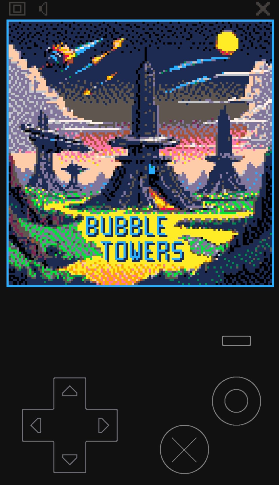{width=60%}

Web-Player (Mobile)

\colNext{0.5}

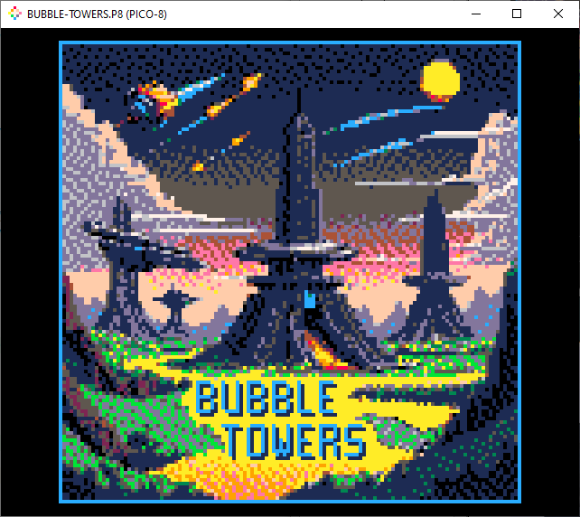

Desktop-Player

\colEnd

Handhelds
---------

\centering
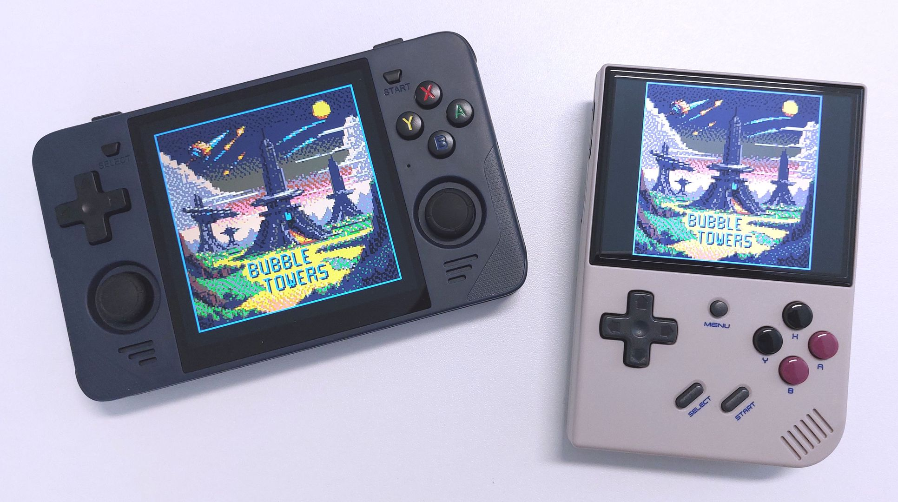{width=90%}

* [Powkiddy RGB30](https://powkiddy.com/products/pre-sale-powkiddy-rgb30-rk3566-handheld-game-console-built-in-wifi)
* [Anbernic RG35XX Plus](https://anbernic.com/products/rg35xx-plus)

The PICO-8 editors
------------------

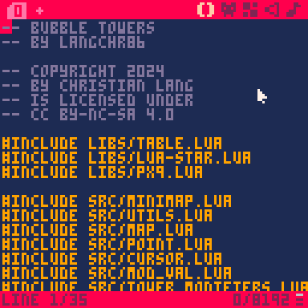{width=30%}
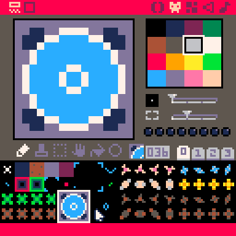{width=30%}
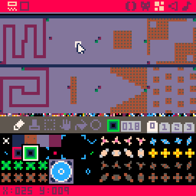{width=30%}

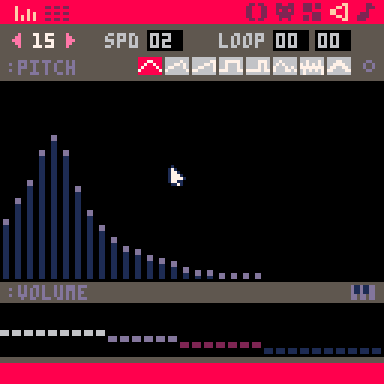{width=30%}
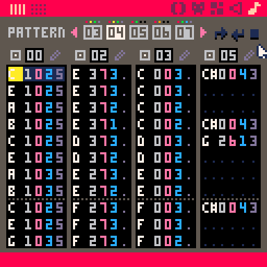{width=30%}

PICO-8 Resources
----------------

*My Project:*

* [Bubble Towers github](https://github.com/langchr86/pico-bubble-towers)
* [Bubble Towers BBS](https://www.lexaloffle.com/bbs/?pid=151651)

*Others:*

* [awesome list for PICO-8](https://github.com/pico-8/awesome-PICO-8)
* [Pico-8 Hero Tutorials](https://www.lexaloffle.com/bbs/?tid=28030)

*Official:*

* [PICO-8 Resources](https://www.lexaloffle.com/pico-8.php?page=resources)
* [PICO-8 FAQ](https://www.lexaloffle.com/pico-8.php?page=faq)
* [PICO-8 User Manual](https://www.lexaloffle.com/dl/docs/pico-8_manual.html)
* [PICO-8 BBS Carts](https://www.lexaloffle.com/bbs/?cat=7&carts_tab=1&#sub=2&mode=carts)
* [PICO-8 Wiki](https://pico-8.fandom.com/wiki/Pico-8_Wikia)

Lua Resources
-------------

* [Lua About](https://www.lua.org/about.html)
* [Lua Getting started](https://www.lua.org/start.html)
* [Programming in Lua](https://www.lua.org/pil/contents.html)
* [Online Compiler](https://onecompiler.com/lua)
